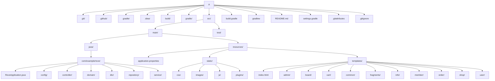

# RÊVE - 향수 쇼핑몰 프로젝트

RÊVE는 사용자들이 다양한 향수를 탐색하고 구매할 수 있는 온라인 향수 쇼핑몰 프로젝트입니다. 직관적인 사용자 인터페이스와 안정적인 백엔드 시스템을 통해 편리하고 즐거운 쇼핑 경험을 제공합니다.

## 주요 기능

*   **제품 관리:** 향수 제품 목록 조회, 상세 정보 확인, 검색 기능.
*   **장바구니:** 선택한 제품을 장바구니에 담고 수량을 조절하는 기능.
*   **주문 및 결제:** 장바구니의 제품을 주문하고 결제하는 프로세스 (Toss Payments 연동 가능성).
*   **회원 시스템:** 사용자 회원 가입, 로그인, 마이페이지, 주문 내역 조회.
*   **관리자 페이지:** 제품, 주문, 회원, 게시판 등 쇼핑몰 전반을 관리하는 기능.
*   **게시판:** 공지사항, Q&A 등 사용자 소통을 위한 게시판.

## 사용 기술

### 백엔드

*   **언어:** Java
*   **프레임워크:** Spring Boot
*   **빌드 도구:** Gradle
*   **데이터베이스:** (application.properties를 통해 설정 가능. 개발 환경에서는 H2 Database 또는 MySQL/PostgreSQL 등 외부 DB 사용 가능)

### 프론트엔드

*   **템플릿 엔진:** Thymeleaf
*   **마크업/스타일/스크립트:** HTML5, CSS3, JavaScript
*   **UI 프레임워크:** Bootstrap
*   **JavaScript 라이브러리:** jQuery, Chart.js 등

## 시작하기

### 필수 요구사항

*   Java Development Kit (JDK) 21 이상
*   Git

### 설치 및 실행

1.  **프로젝트 클론:**
    ```bash
    git clone https://github.com/heeezni/reve.git
    cd reve
    ```

2.  **프로젝트 빌드:**
    ```bash
    ./gradlew build
    ```

3.  **애플리케이션 실행:**
    ```bash
    ./gradlew bootRun
    ```
    애플리케이션은 기본적으로 `http://localhost:8080`에서 실행됩니다.

## 프로젝트 구조

```
reve/
├───src/
│   ├───main/
│   │   ├───java/                 # 백엔드 Java 소스 코드 (Spring Boot 애플리케이션)
│   │   │   └───com/example/reve/
│   │   │       ├───ReveApplication.java
│   │   │       ├───config/       # 설정 클래스
│   │   │       ├───controller/   # REST API 및 웹 컨트롤러
│   │   │       ├───domain/       # 엔티티 및 도메인 모델
│   │   │       ├───dto/          # 데이터 전송 객체 (DTO)
│   │   │       ├───repository/   # 데이터 접근 계층 (Spring Data JPA)
│   │   │       └───service/      # 비즈니스 로직 서비스
│   │   └───resources/
│   │       ├───application.properties # 애플리케이션 설정 (데이터베이스, 서버 포트 등)
│   │       ├───static/           # 정적 리소스 (CSS, JS, 이미지, 플러그인)
│   │       └───templates/        # HTML 템플릿 (Thymeleaf 등)
│   └───test/                     # 단위 및 통합 테스트
├───build.gradle                  # Gradle 빌드 설정 파일
└───README.md                     # 프로젝트 README 파일
```


